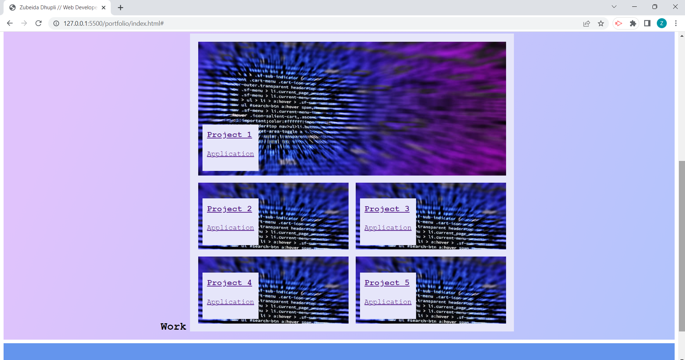
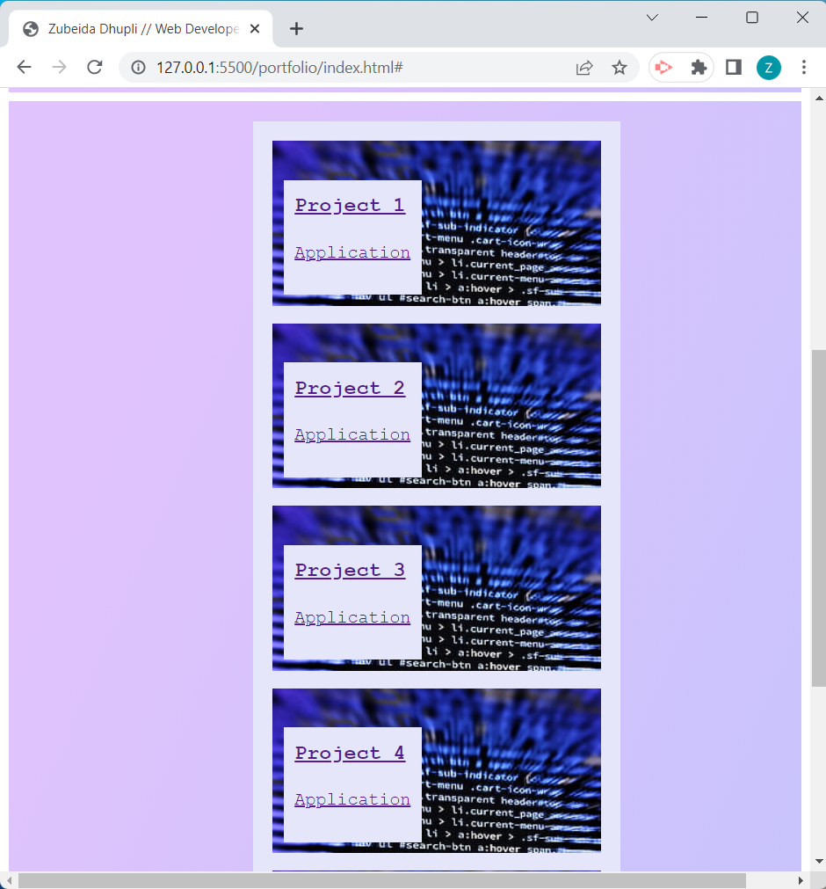

# Portfolio
## Description

I have built a webpage that will act as my Portfolio. I created this so that when I apply to jobs in the future, I can use this portfolio to showcase myself and all the projects that I have completed (I will add projects once I have completed them). 

## Installation

N/A

## Usage

To use the website, you would use this link: https://zubeidadhupli.github.io/portfolio/ .The link should take you to where the webpage is live and when you make the screen smaller than 768px, the screen should be responsive and look different. This was done so that the website would be easier to navigate on smaller devices. Here are two screenshots that shows the difference between the two screen displays:  ,  .

## License

MIT license that was chosen when I first created the repository.